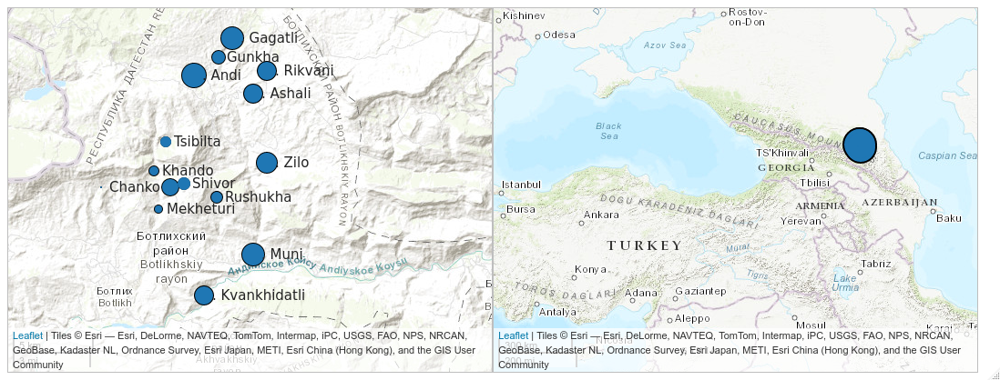

```{r setup, include=FALSE}
knitr::opts_chunk$set(echo = FALSE)
options(tinytex.verbose = TRUE)
library(tidyverse)
theme_set(theme_bw())

# read zilo data
zilo_experiment <- read_csv("data/zilo_experiment_questionary.csv")

# mask and prepare raw data from the survey
nd_fes <- read_csv("data/nakh-daghestanian_fieldwork_elicitation_survey.csv")
if("Sygnatura czasowa" %in% colnames(nd_fes)){
  nd_fes %>% 
    mutate(id = 1:n()) %>% 
    pivot_longer(names_to = "question", values_to = "answer", 3:50) %>% 
    select(-1) %>% 
    filter(!is.na(answer)) %>% 
    rename(lang = colnames(nd_fes)[2]) %>% 
    mutate(lang = ifelse(lang == "на русском", "ru", "en"),
           q_id = str_extract(question, "\\d{1,}")) %>% 
    filter(q_id != 0, q_id != 1) %>% 
    mutate(q_name = case_when(
      q_id == 2 ~ "education_lvl",
      q_id == 3 ~ "interest",
      q_id == 4 ~ "linguistics_university",
      q_id == 5 ~ "student_fieldwork",
      q_id == 6 ~ "finish_study",
      q_id == 7 ~ "place_of_study",
      q_id == 8 ~ "place_of_work",
      q_id == 9 ~ "n_people_fieldwork_actual",
      q_id == 10 ~ "n_people_fieldwork_preference",
      q_id == 11 ~ "goals_fieldwork",
      q_id == 12 ~ "main_goal_fieldwork",
      q_id == 13 ~ "elicitation",
      q_id == 14 ~ "corpora",
      q_id == 15 ~ "n_speakers_preference",
      q_id == 16 ~ "n_speakers_actual",
      q_id == 17 ~ "contradicted_answers",
      q_id == 18 ~ "selfcontradicted_answers",
      q_id == 19 ~ "younger_13",
      q_id == 20 ~ "older_70",
      q_id == 21 ~ "prefer_work",
      q_id == 22 ~ "prefer_not_to_work"
      )) %>% 
    pivot_wider(names_from = q_name, values_from = answer, -c("question", "q_id")) %>% 
    mutate(education_lvl = case_when(
      education_lvl == "доктором наук" ~ "Professor",
      education_lvl == "кандидатом наук" ~ "PhD",
      str_detect(education_lvl, "студентом") ~ "Graduate student",
      TRUE ~ education_lvl),
      interest_phonology = str_detect(interest, "фонол|phonetics"),
      interest_morphology = str_detect(interest, "морфология|Morphology"),
      interest_syntax = str_detect(interest, "синтаксис|Syntax"),
      interest_lexicon = str_detect(interest, "лексика|Lexicon"),
      interest_discourse = str_detect(interest, "дискурс|discourse"),
      interest_sociolinguistics = str_detect(interest, "социолингвистика|Sociolinguistics"),
      interest_typology = str_detect(interest, "типология|typology"),
      interest_documentation = str_detect(interest, "документирование|documentation"),
      interest_dialectology = str_detect(interest, "диалектология|Dialectology"),
      interest_historical = str_detect(interest, "сравнительно|Historical"),
      interest_computer = str_detect(interest, "компьютерная|computer"),
      interest_psycholinguistics = str_detect(interest, "психолингвистика|Psycholinguistics"),
      linguistics_university = !str_detect(linguistics_university, "No|нет"),
      student_fieldwork = !str_detect(student_fieldwork, "No|нет"),
      finish_study = str_replace(finish_study, "philosophy, logics, linguistics", "2011"),
      finish_study = str_replace(finish_study, "не закончил\\(а\\)", "2020"),
      finish_study = as.integer(str_extract(finish_study, "\\d{1,}")),
      study_moscow = str_detect(place_of_study, "Moscow|Москве"),
      study_europe = str_detect(place_of_study, "Europe|Европе"),
      study_us = str_detect(place_of_study, "the US"),
      place_of_work = str_replace(place_of_work, "не работал\\(а\\)", "I've never worked as a teacher or researcher."),
      place_of_work = str_replace(place_of_work, "в Европе", "in Europe"),
      place_of_work = str_replace(place_of_work, "в Москве", "in Moscow"),
      one_fildwork = str_detect(n_people_fieldwork_actual, "One|один"),
      small_group_fildwork = str_detect(n_people_fieldwork_actual, "small|маленькая"),
      large_group_fildwork = str_detect(n_people_fieldwork_actual, "large|большая"),
      n_people_fieldwork_preference = str_replace(n_people_fieldwork_preference, "где один/одна исследователь", "I prefer to work alone"),
      n_people_fieldwork_preference = str_replace(n_people_fieldwork_preference, "в маленькой группе \\(2-5 человек\\)", "with a small group (2-5 people)"),
      n_people_fieldwork_preference = str_replace(n_people_fieldwork_preference, "в большой группе", "with a large group"),
      educational_goal = str_detect(goals_fieldwork, "[Ee]ducational|учебные"),
      documentation_goal = str_detect(goals_fieldwork, "documentation|документация"),
      application_goal = str_detect(goals_fieldwork, "Application|применение"),
      research_goal = str_detect(goals_fieldwork, "Research|исследование"),
      main_goal_fieldwork = str_replace_all(main_goal_fieldwork, "документация языка", "Language documentation"),
      main_goal_fieldwork = str_replace_all(main_goal_fieldwork, "исследование грамматической темы \\(в широком смысле\\)", "Research on some theoretical problem (in the broadest possible sense)"),
      main_goal_fieldwork = str_replace(main_goal_fieldwork, "Не готов противопоставлять", "no answer"),
      elicitation = str_replace(elicitation, "Да", "Yes"),
      corpora = !str_detect(corpora, "No|Нет")) %>% 
    select(-interest, -place_of_study, -n_people_fieldwork_actual, -goals_fieldwork) %>% 
    count(n_speakers_preference)
}
```

## Variationism

According to [@eckert16] there are three waves of Variationism:

>- [@labov63] on Martha's Vineyard /ai/ ~ /au/, [@trudgill74], [@wolfram69]


## Data

Data were collected from

>- `r length(unique(zilo_experiment$speaker_id))` Zilo speakers (Upper Andic, Northeast Caucasian) during the fieldwork in 2019



Created with `lingtypology` [@moroz2017]

>- and `r nrow(nd_fes)` Nakh-Daghestanian researches via online questionary

# References {.allowframebreaks}